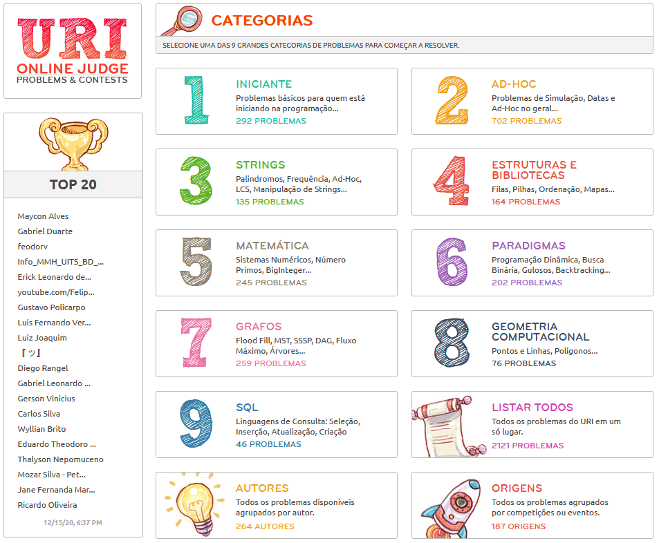
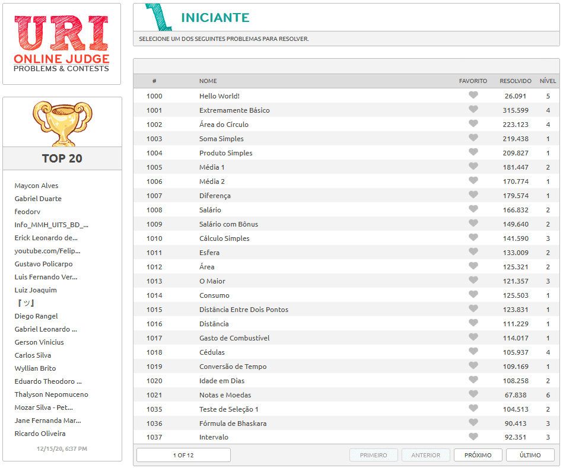
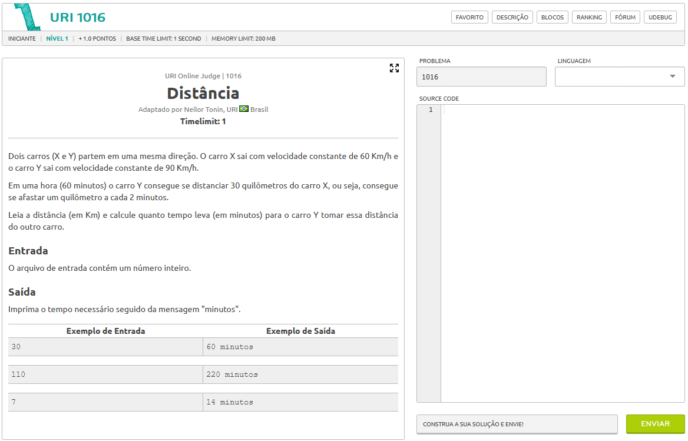

# URI Online Judge

> A collection of solutions for the URI Online Judge using C#, Dart, JavaScript, PHP, Python and SQL languages.

*Read it in other languages:* [English](https://github.com/filimor/uri-online-judge/blob/master/README.md) :us:,
[Português (Brasil)](https://github.com/filimor/uri-online-judge/blob/master/README.pt-BR.md) :brazil:

## Description

This repository is built as problems are solved on the website
[URI Online Judge Problems and Contests](https://www.urionlinejudge.com.br/) that has over 2100 problems and 9 main
categories. It supports many languages (including C, C++, C#, Dart, Go, Haskell, Java, JavaScript, Kotlin, Lua, Pascal,
PHP, Python, Ruby and Scala) and is very useful to practicing and learning programming logic and algorithms. The website
is available in english, portuguese and spanish. Although the repository name and readme follow the open source language
convention (english), the problems names, descriptions, variables names and strings are all in portuguese.
Unfortunately, the rest of the repository pages remains without translation.

<!-- //TODO-->

## Screenshots

 
 

## Problemas by category

1. [Beginner](problemas/1-iniciante.md) - Basic problems for anyone who has just started to program...
2. [Ad-Hoc](problemas/2-ad-hoc.md) - Simulation Problems, Dates, Games and general Ad-Hoc...
3. [Strings](problemas/3-strings.md) - Palindromes, Frequency, Ad-Hoc, LCS, String Manipulation...
4. [Data Structures and Libraries](problemas/4-estruturas-bibliotecas.md) - Queue, Stack, Sort, Map, Set...
5. [Mathematics](problemas/5-matematica.md) - Number Theory, Prime Numbers, Combinatorics, BigInteger...
6. [Paradigms](problemas/6-paradigmas.md) - Dynamic Programming, Binary Search, Greedy, Backtracking ...
7. [Graph](problemas/7-grafos.md) - Flood Fill, MST, SSSP, DAG, Maximum Flow, Tree...
8. [Computational Geometry](problemas/8-geometria-computacional.md) - Points and Lines, Polygon...
9. [SQL](problemas/9-sql.md) - Query Languages: Select, Insert, Update, Create

## Problems by number

[1000 a 1099](problemas/1000) |
[1100 a 1199](problemas/1100) |
[1200 a 1299](problemas/1200) |
[1300 a 1399](problemas/1300) |
[1400 a 1499](problemas/1400) |
[1500 a 1599](problemas/1500) |
[1600 a 1699](problemas/1600) |
[1700 a 1799](problemas/1700) |
[1800 a 1899](problemas/1800) |
[1900 a 1999](problemas/1900) |
[2000 a 2099](problemas/2000) |
[2100 a 2199](problemas/2100) |
[2200 a 2299](problemas/2200) |
[2300 a 2399](problemas/2300) |
[2400 a 2499](problemas/2400) |
[2500 a 2599](problemas/2500) |
[2600 a 2699](problemas/2600) |
[2700 a 2799](problemas/2700) |
[2800 a 2899](problemas/2800) |
[2900 a 2999](problemas/2900) |
[3000 a 3099](problemas/3000) |
[3100 a 3199](problemas/3100)

## Build With

- [Microsoft Visual Studio 2019 Community Edition](https://visualstudio.microsoft.com/vs/community/)
- [Visual Studio Code](https://code.visualstudio.com/)
- [PyCharm 2020 Community](https://www.jetbrains.com/pycharm/)
- [uDebug](https://www.udebug.com/)

## Contributing

If you want to help to translate the project or include other languages you're welcome! Please follow our
[code of conduct](https://github.com/filimor/uri-online-judge/blob/master/CODE_OF_CONDUCT.md).

## Translations

- [English](https://github.com/filimor/uri-online-judge/blob/master/README.md)
- [Português (Brasil)](https://github.com/filimor/uri-online-judge/blob/master/README.pt-br.md)

## Credits

- All problems by [URI Online Judge](https://www.urionlinejudge.com.br) Problems & Contest
- All solutions coded by [@filimor](https://github.com/filimor)
- The repository structure are based on the [URI-Potigol](https://github.com/potigol/URI-Potigol) project by
[@Potigol](https://github.com/potigol)

## Contact

- [E-mail](mailto:filimor@posteo.net)
- [LinkedIn](https://www.linkedin.com/in/filimor/)
- [Twitter](https://www.twitter.com/filimorbr/)
- [URI Profile](https://www.urionlinejudge.com.br/judge/users/statistics/353923)

## License

This project is licensed under the MIT License - see the
[LICENSE.md](https://github.com/filimor/uri-online-judge/blob/master/LICENSE "MIT") file for details.
